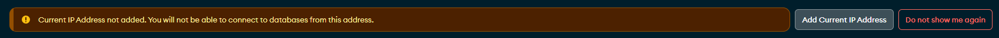

<h1>Tutorial on how to create a simple API using Node.js, Express, and MongoDB</h1>

This repository contains a simple API created using Node.js and Express, connected to MongoDB. If you want to visit The tutorial video I used to learn and build this API, you can find it [here](https://www.youtube.com/watch?v=9OfL9H6AmhQ).

## Table of Contents
- [Tools, Libraries, and Dependencies Used](#tools-libraries-and-dependencies-used)
  - [Prerequisites](#prerequisites)
  - [Usage](#usage)
  - [Troubleshooting](#troubleshooting)
  - [Learn How](#learn-how)
    - [Setting Up Routes and Server](#setting-up-routes-and-server)
      - [Getting Started](#getting-started)
      - [Testing the Server](#testing-the-server)
      - [Accessing the API app within browser](#accessing-the-api-app-within-browser)
      - [Using Nodemon for Development](#using-nodemon-for-development)
    - [Connecting to MongoDB](#connecting-to-mongodb)
    - [Additional Resources](#additional-resources)

---

# Tools, Libraries, and Dependencies Used
- JavaScript
- MongoDB (database)
- npm (Package manager for the JavaScript)
- Node.js (JavaScript runtime environment)
- Express.js (Node.js web application framework)
- Mongoose (Object Data Modeling (ODM) library for MongoDB)
- Nodemon (Tool for automatically restarting the node application)
- Insomnia Core (open-source API testing platform)
  
## Prerequisites
Before proceeding, ensure you have the following knowledge and tools:
- JavaScript knowledge
- Understanding of REST APIs
- Understanding of databases
- Knowledge of npm or a package manager and Node.js

## Usage

1. Create a database in [MongoDB](https://cloud.mongodb.com/).

2. Ensure that you are connected to the internet to successfully connect to the database.

3. Create a `.env` file and add the following line to connect to the database:
    ```
    MONGODB_URI=<your_mongodb_uri>
    ```
    And replace `<your_mongodb_uri>` with the actual **MongoDB connection URI** for your specific database. Also make sure to include the necessary authentication credentials, host, port, and other relevant details in the URI.

4. Run `npm run dev` to start the server.

5. Visit [http://localhost:3000/](http://localhost:3000/) to access the application.

## Troubleshooting

1. `Error connecting to MongoDB`:
   This error may indicate that you are not connected to the internet, resulting in a failed database connection.

2. `Error connecting to MongoDB: MongooseServerSelectionError: Could not connect to any servers in your MongoDB Atlas cluster. One common reason is that you're trying to access the database from an IP that isn't whitelisted. Make sure your current IP address is on your Atlas cluster's IP whitelist`:
   This error occurs when the IP address in the database is not whitelisted. **To resolve this issue**:

   1. Open your database dashboard and click on **ADD CURRENT IP ADDRESS**.
      

   2. If the first step doesn't work, open [whatismyip](https://www.whatismyip.com/) and copy your **IPv4** address. In the MongoDB interface, navigate to **Network Access** in the sidebar menu and click **ADD IP ADDRESS**, then paste the copied **IPv4** address.
   
   3. Restart the server.

---

## Learn How

### Setting Up Routes and Server

#### Getting Started
To handle the server, create a new file such as `server.js`, `index.js`, or `app.js`, all these names are popular for entry points fo Node.js applications. In this example, `app.js` will be used.

First, require the `express` package and assign it to the variable `express`: `const express = require('express')`. Then, create an instance of the Express application using `express()`: `const app = express()`, This `app` object represents the Express app and is used to handle HTTP requests and responses. 

```javascript
const express = require('express');
const app = express();
```

**Then add a router:**

1. Define a route that listens to requests
   ```javascript
   const PORT = 3000;
   app.listen(PORT, () => {
       console.log("Server Listening on PORT:", PORT);
   });
   ```

2. Define an endpoint
   Creating endpoints is done using the `app.METHOD()`: `app` is our variable that creates an instance of the `express()` and `METHOD` refers to the different HTTP methods, like GET, POST, PUT, and DELETE. It takes two arguments: the route path and a callback function that specifies what to do when a request is made to that route.
   Here, the `app.get()` method is used to handle HTTP GET requests.

   ```JavaScript
   // respond with "hello world" when a GET request is made to the homepage
   app.get('/', (req, res) => {
       res.send('Hello world!')
   })
   ```

Here, the route path is **'/'** which indicates the homepage. The `res.send()` function is used to send a response back to the client (in this case, the browser is the client), so when accessing the browser, it will show `hello world`.

Finally, the code to set up a basic router will be:

```javascript
const express = require('express')
const app = express()
const PORT = 3000;

app.get('/', (req, res) => {
    res.send('Hello world!')
})

app.listen(PORT, () => {
    console.log("Server Listening on PORT:", PORT);
});
```

**Note:** It is preferable to avoid changing the default variable names used in the official Express guideline, such as `express` for the Express package and `app` for the application object. This is recommended to maintain consistency and make the code more understandable for other developers who are familiar with the Express framework.

#### Testing the Server

To run the app, use the command `node app.js` (replace `app.js` with your file name: `node <file-name.js>`). Alternatively, you can add the command to the `scripts` section in the `package.json` file:

```json
"scripts": {
    "test": "echo \"Error: no test specified\" && exit 1",
+   "start": "node app.js"
},
```
Now the server can be run with the `npm run serve` command.

#### Accessing the API app within browser

To access the app in the browser, it will be accessible at `localhost:3000`. But, ensure to run `npm run serve` before accessing it.

#### Using Nodemon for Development
> nodemon is a tool that helps develop Node.js based applications by automatically restarting the node application when file changes in the directory are detected. nodemon does not require any additional changes to your code or method of development. 
> ([Nodemon - github](https://github.com/remy/nodemon))

So Nodemon is used to automatically restart the Node.js application when file changes are made, to avoid manually restarting it.

1. Install Nodemon: 
   Run `npm i --save-dev nodemon`.

2. Use Nodemon: 
   Add a script to `package.json` and name it `dev` to handle the `nodemon app.js` command:
   ```json
   "scripts": {
       "test": "echo \"Error: no test specified\" && exit 1",
       "start": "node app.js",
   +   "dev": "nodemon app.js"
   },
   ```

Now it's possible to run the app using `npm run dev`.

### Connecting to MongoDB
*Pending. Details will be added later ..*

### Additional Resources
1. [Express Explained with Examples - Installation, Routing, Middleware, and More - freeCodeCamp](https://www.freecodecamp.org/news/express-explained-with-examples-installation-routing-middleware-and-more/)
2. [Express Official Guide](https://expressjs.com/en/guide/routing.html)
3. [How to Create a REST API with Node.js and Express - Postman Blog](https://blog.postman.com/how-to-create-a-rest-api-with-node-js-and-express/)